# 環境設定

## 1. 移動mini.exe

1. 打開 「 SeaDeep-mini-sample-main 」 資料夾
2. 進入 「 bin 」 資料夾
3. 進入 「 windows 」 資料夾
4. 複製mini.exe
5. 放至與Python主程式執行檔（train.py）相同的資料夾內

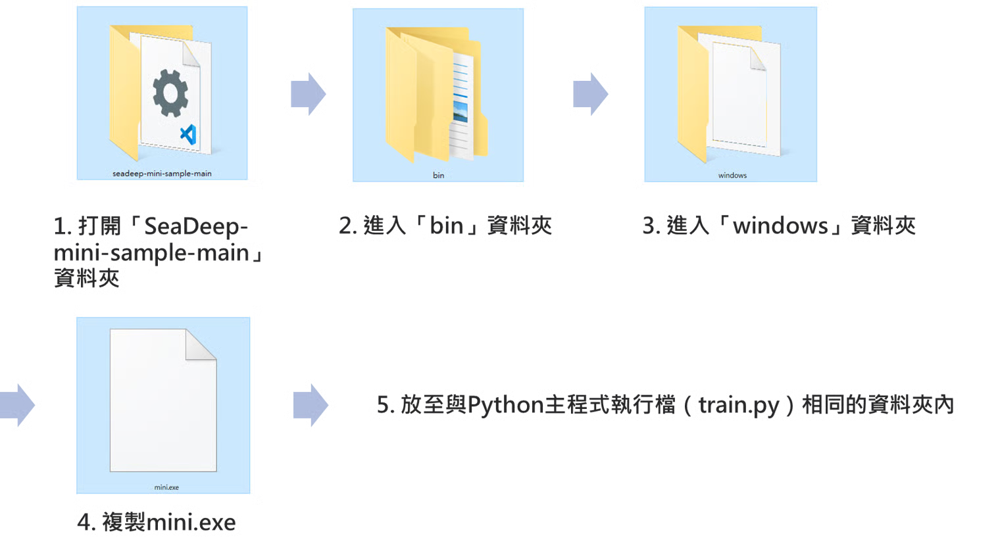

## 2. 移動其他3個檔案

1. 打開 「 quick\_start 」 資料夾
2. 複製 「 mini\_sdk 」 資料夾與 「 mini.yaml 」 、 「 infer.py 」 2個檔案
3. 放至與Python主程式執行檔（train.py）相同的資料夾內

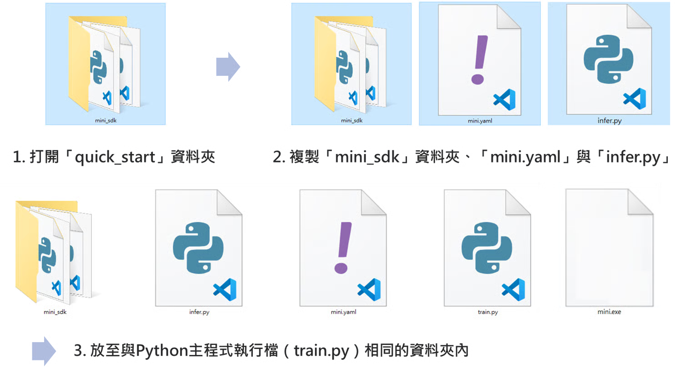

## 3. 設定mini.yaml檔

1. 打開移動後的 「 mini.yaml 」 檔
2. 設定以下參數：

* <font color="blue">**name**</font>：此核心名稱。
* <font color="blue">**token**</font>：此用戶身分授權。
* <font color="blue">**worker**</font>：此核心可以同時執行的任務數量。
* <font color="blue">**public：false**</font>：是否將此核心對其他用戶公開。
* <font color="blue">**port**</font>：此裝置與SeaDeep連接的端口。
* <font color="blue">**endpoint**</font>：SeaDeep的API伺服器位置。
* <font color="blue">**training**</font>：訓練項目。
  * <font color="blue">**command：**</font>"python"</font>：使用python執行。
  * <font color="blue">**args：**</font>\</font>&#x20;"train.py"</font>**&#x20;</font>：要執行訓練的檔案名稱。
* <font color="blue">**inference**</font>：推論項目。
  * <font color="blue">**command：**</font>"python"</font>：使用python執行。
  * <font color="blue">**args：**</font>\</font>&#x20;"infer.py"</font>**&#x20;</font>：要執行推論的檔案名稱。

> **port**：注意避免使用到與此電腦或SeaDeep其他核心相同的port。

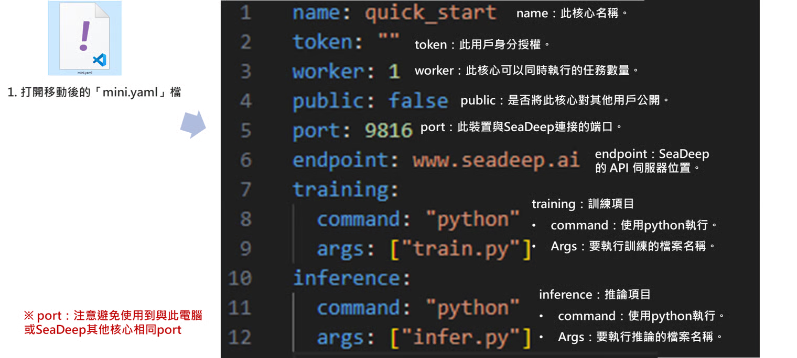

## 4. 匯入train.py所需套件

### 4.1 匯入套件

1. 打開 「 train.py 」 。
2. 從mini\_sdk中import圖片左方的所有套件。

> 此為範例檔案，操作時需使用欲放上SeaDeep核心的檔案。

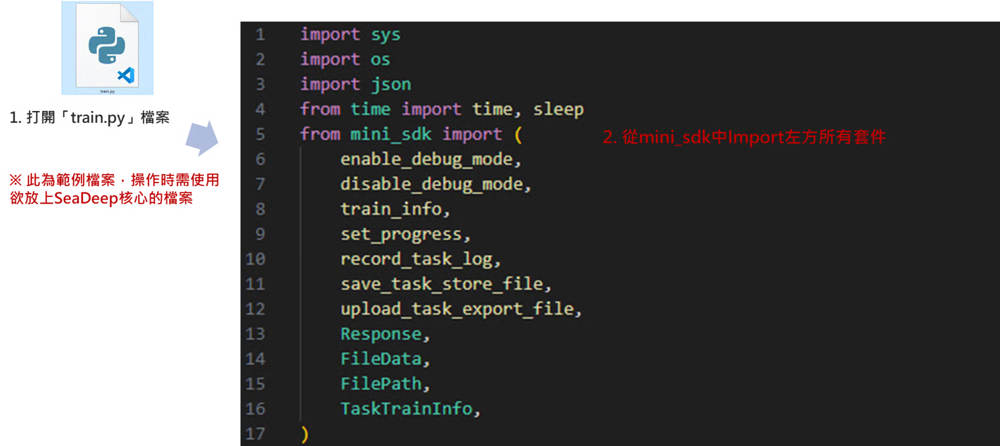

### 4.2 重要套件說明

* set\_progress：設定當前進度。
* record\_task\_log：任務訓練的歷程紀錄。
* save\_task\_store\_file：上傳訓練結果
* upload\_task\_export\_file：上傳訓練好的模型、權重。

> SEA\_TASK\_ID可從範例檔案的127行取得，並透過141行程式顯示

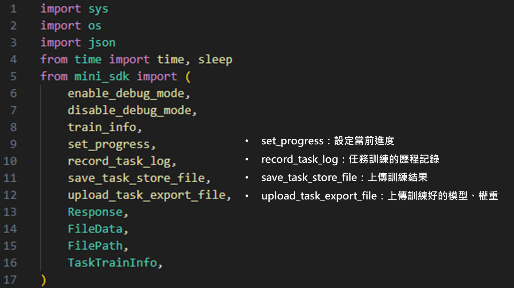

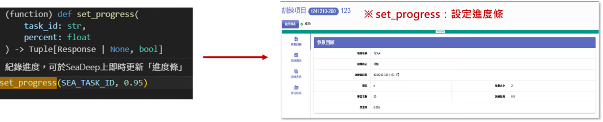

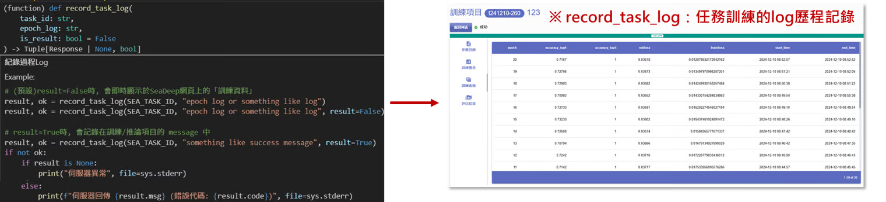

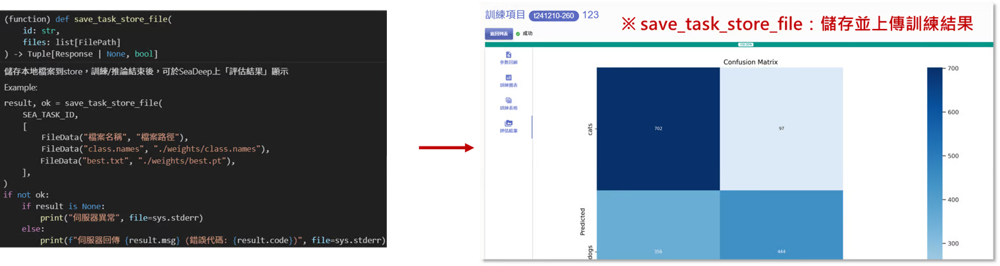

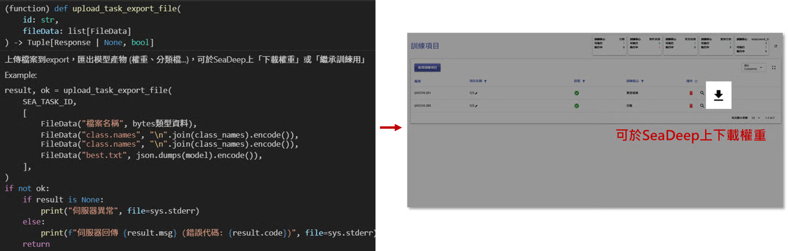

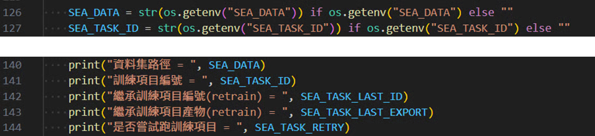

## 5. 將檢查碼放入train.py

下滑找到以下code（圖片中第120行），於code下方放入**檢查碼**，以確認伺服器狀況。

```
if name == ‘main’：
```

> 檢查碼位於範例檔案中的121行\~155行


## 6. 設定預設訓練參數

於train.py內使用以下code設定SeaDeep訓練的預設參數，此數值將顯示於模型訓練時的 「 **模型參數** 」 一欄。

```
param.setdefault( 變數名稱, 預設值 )
```

> 預設參數可設可不設

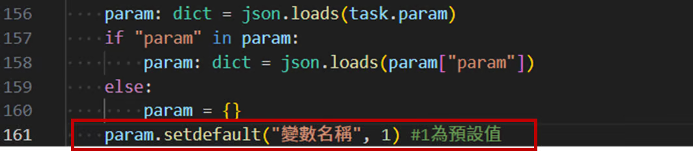

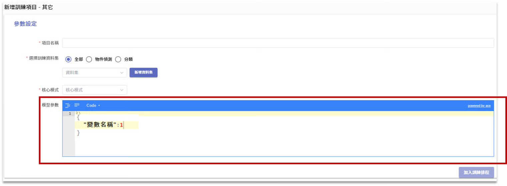
