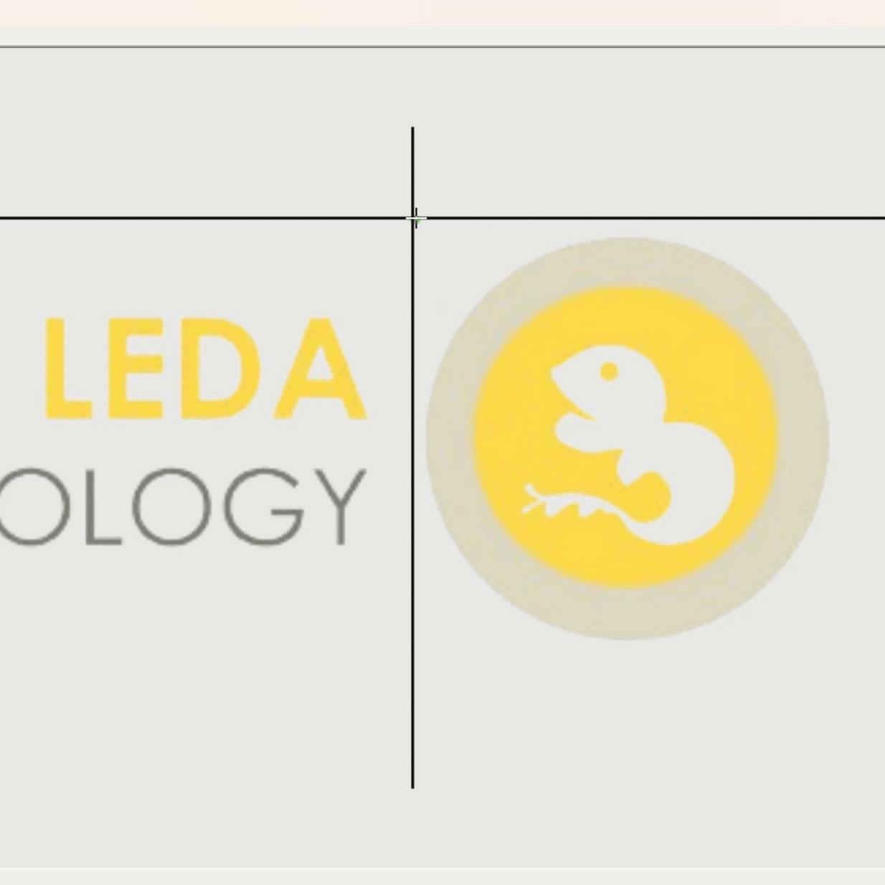

# LabelImg

## 常用功能介紹

* Auto Save mode：自動儲存模式，點擊上方功能列 「 <mark style="color:blue;">View</mark> 」 進入。
* Open Dir：打開欲標記圖片資料夾。
* Change Save Dir：設定標記檔儲存資料夾（須與上方圖片開啟資料夾相同）。
* Next Image：下一張照片，快捷鍵：D（輸入法為英文模式）。
* Prew Image：上一張照片，快捷鍵：A（輸入法為英文模式）。
* PascalVOC：切換標記檔格式，使用預設PascalVOC即可。
* Create RectBox：開始標記。

<figure><figcaption>
LabelImg
</figcaption></figure>

## 標記方式

1. 按住滑鼠左鍵不放並進行拖曳。
2. 輸入標籤名稱並按下 「 <mark style="color:blue;">OK</mark> 」 。
3. 畫面右方會出現標籤名稱。
4. 快捷鍵D進行下一張標記。


標記時可使用Ctrl搭配滑鼠滾輪放大縮小圖片


<figure><figcaption>
進行標記
</figcaption></figure>

<figure><figcaption>
標記方式
</figcaption></figure>

## 注意事項

1. 檔名預設與圖片檔名相同，不須變動。
2. 如在圖片資料夾內找不到標記檔，請**手動點選儲存**或使用 「 **ctrl+s** 」 。
3. 若還是找不到標記檔請確認左方 <mark style="color:red;">「</mark> <mark style="color:red;"></mark><mark style="color:red;">**Change Save Dir**</mark> <mark style="color:red;"></mark><mark style="color:red;">」</mark> <mark style="color:red;"></mark><mark style="color:red;">**位置是否與圖片資料夾相同**</mark> 。
4. 如標記檔副檔名不是XML，請將 「 Save」 下方的按鈕改為PascalVOC。

<figure><figcaption>
注意事項
</figcaption></figure>


上傳訓練資料請[**參考新增資料集頁面**](../../mo-xing-xun-lian-tui-lun/wu-jian-zhen-ce/xin-zeng-zi-liao-ji/)

