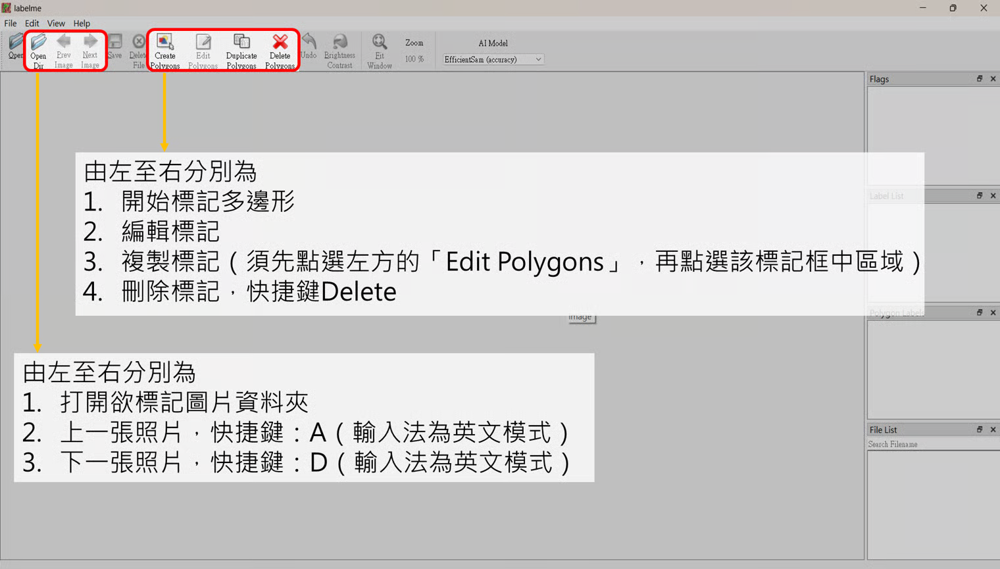
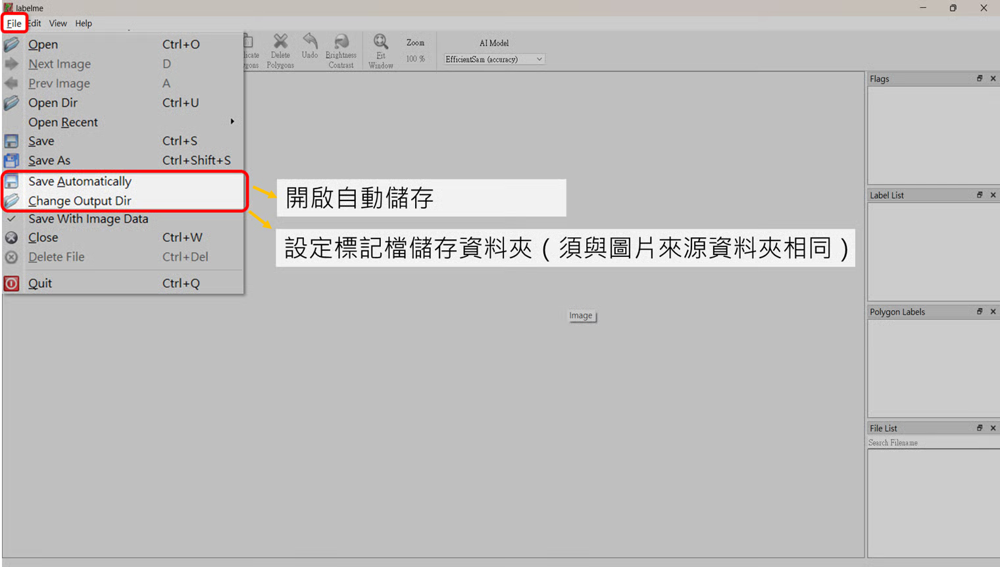
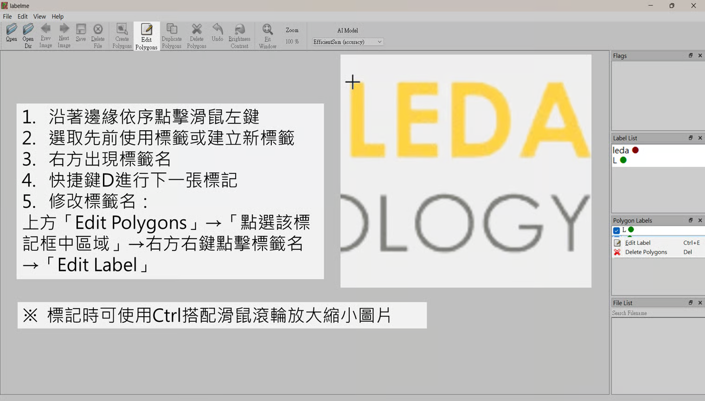
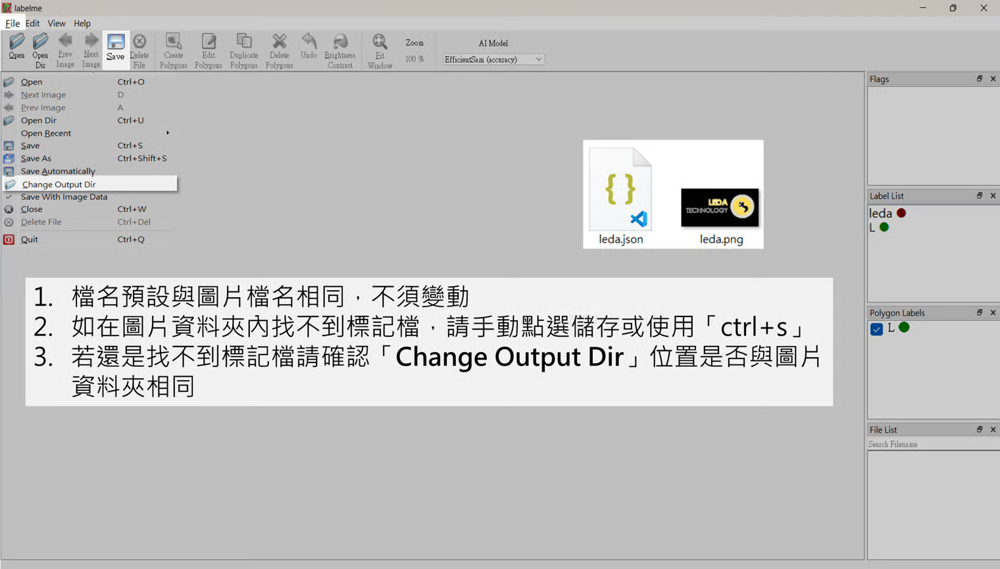

# Labelme

## 常用功能介紹

* Open Dir：打開欲標記圖片資料夾。
* Next Image：下一張照片，快捷鍵：D（輸入法為英文模式）。
* Prew Image：上一張照片，快捷鍵：A（輸入法為英文模式）。
* Create Polygons：開始標記多邊形。
* Edit Polygons：編輯標記。
* Duplicate Polygons：複製標記（須先點選左方的「Edit Polygons」，再點選該標記框中區域）。
* Delete Polygons：刪除標記，快捷鍵Delete。
* Save Automatically：開啟自動儲存，點擊上方功能列 「 <mark style="color:blue;">File</mark> 」 進入。
* Change Output Dir：設定標記檔儲存資料夾（須與圖片來源資料夾相同），點擊上方功能列 「 <mark style="color:blue;">File</mark> 」 進入。

## 標記方式

1. 沿著邊緣依序點擊滑鼠左鍵。
2. 選取先前使用標籤或建立新標籤。
3. 右方出現標籤名。
4. 快捷鍵D進行下一張標記。
5. 修改標籤名：點擊 「 <mark style="color:blue;">Edit Polygons</mark> 」 → 點選該標記框中區域 → 右方右鍵點擊標籤名 → 「 <mark style="color:blue;">Edit Label</mark> 」&#x20;

> 標記時可使用Ctrl搭配滑鼠滾輪放大縮小圖片

## 注意事項

1. 檔名預設與圖片檔名相同，不須變動。
2. 如在圖片資料夾內找不到標記檔，請手動點選儲存或使用 「 ctrl+s 」 。
3. 若還是找不到標記檔請確認 <mark style="color:red;">**「 Change Output Dir 」 位置是否與圖片資料夾相同**</mark>。

> 上傳訓練資料請[**參考新增資料集頁面**](../../mo-xing-xun-lian-tui-lun/shi-li-fen-ge/xin-zeng-zi-liao-ji/)
