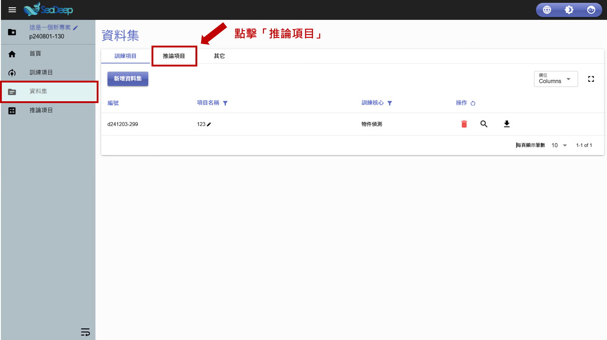
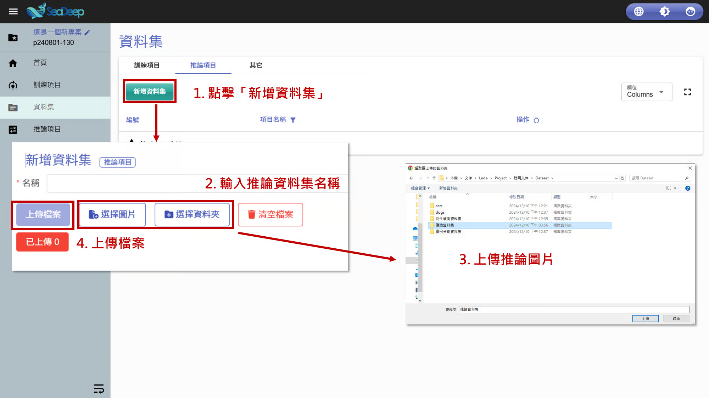
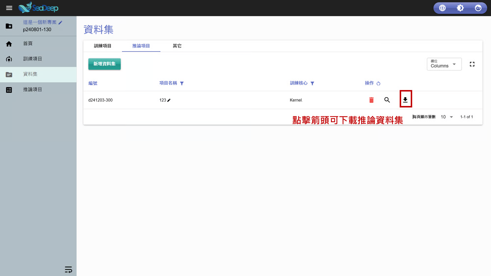

# 上傳推論資料

## 1. 選擇推論項目

1. 從左方工作列進入 「 資料集 」 。
2. 點擊**資料集內**的 「 推論項目 」 。

## 2. 上傳推論資料

1. 點擊 「 新增資料集」。
2. 為推論資料集命名。
3. 點擊 「 選擇圖片」 或 「 選擇資料夾」 上傳圖片。
4. 點擊 「 上傳檔案 」 。 &#x20;
5. 推論資料集上傳完成。

> 點擊 「 操作」 的 「 向下箭頭 」 即可下載推論資料集。

