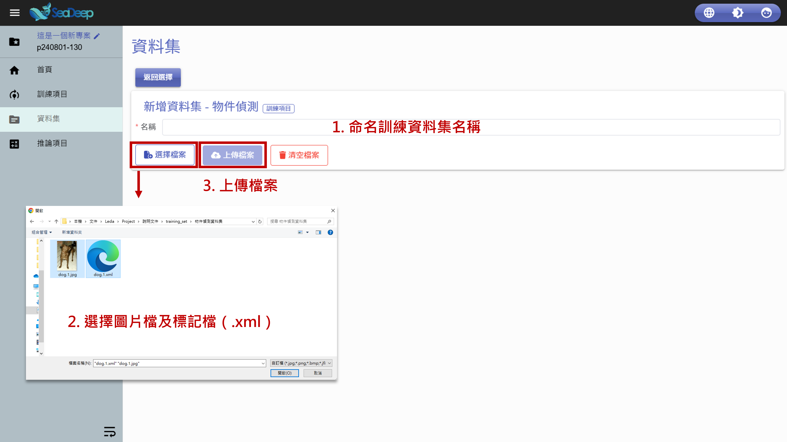

# 上傳訓練資料

## 1. 選擇模型

1. 從左方工作列進入 「 <mark style="color:blue;">資料集</mark> 」 。
2. 確認所在位置在**資料集內**的 「 訓練項目 」 後，點擊 「 <mark style="color:blue;">新增資料集</mark>」。
3. 點擊 「 <mark style="color:blue;">物件偵測</mark> 」 圖示。

<figure><figcaption></figcaption></figure>

## 2. 上傳訓練資料

1. 為訓練資料集命名。
2. 點擊 「 <mark style="color:blue;">選擇檔案</mark>」 ，選擇要上傳的**圖片**以及**標記檔**（ .xml ）。
3. 點擊 「 <mark style="color:blue;">上傳檔案</mark> 」 。
4. 訓練資料集上傳完成。


上傳完成後，點擊 「 操作」 的 「 <mark style="color:blue;">向下箭頭</mark> 」 即可下載訓練資料集。


<figure><figcaption>
上傳訓練資料
</figcaption></figure>

<figure><figcaption>
上傳完成
</figcaption></figure>
