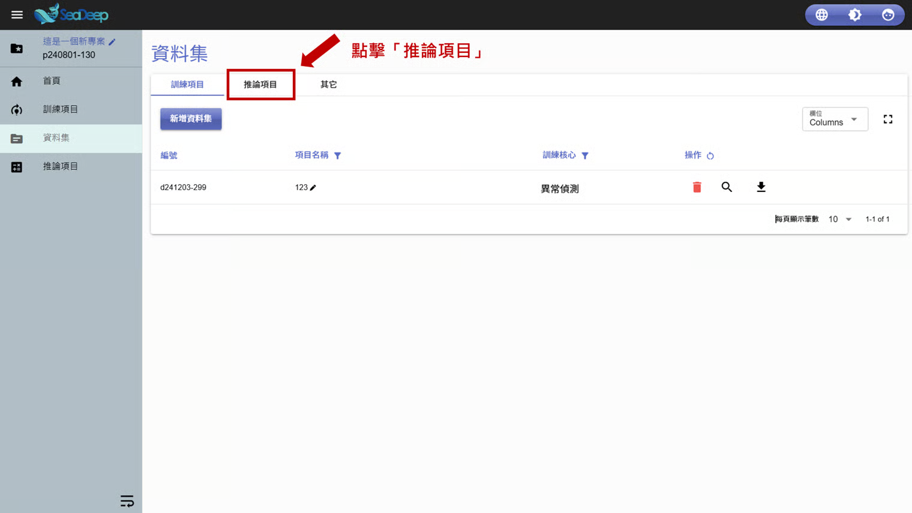
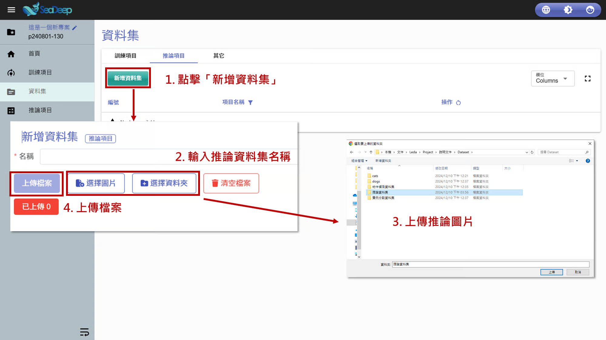
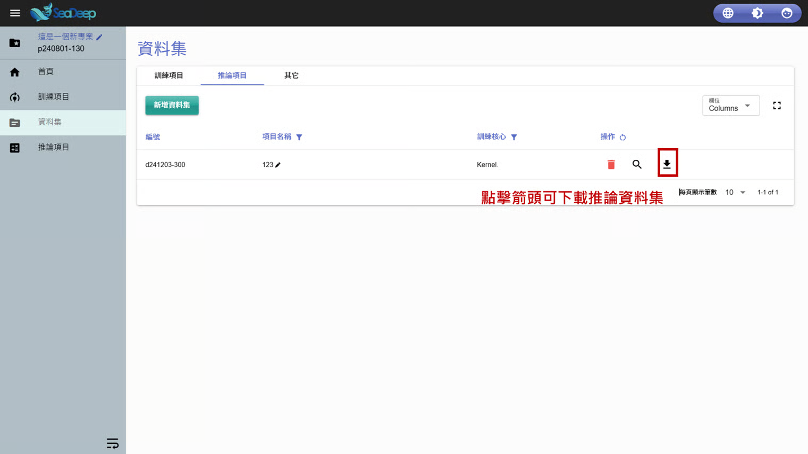

# 上傳推論資料

## 1. 選擇推論項目

1. 從左方工作列進入 「 <mark style="color:blue;">資料集</mark> 」 。
2. 點擊**資料集內**的 「 推論項目 」 。

## 2. 上傳推論資料

1. 點擊 「 <mark style="color:blue;">新增資料集</mark> 」。
2. 為推論資料集命名。
3. 點擊 「 <mark style="color:blue;">選擇圖片</mark> 」 或 「 <mark style="color:blue;">選擇資料夾</mark> 」 上傳推論圖片。
4. 點擊 「 <mark style="color:blue;">上傳檔案</mark> 」 。
5. 推論資料集上傳完成。

> 上傳完成後，點擊 「 操作」 的 「 <mark style="color:blue;">向下箭頭</mark> 」 即可下載推論資料集。

