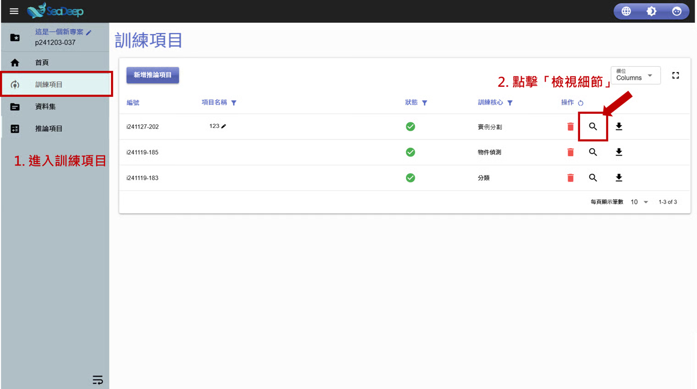
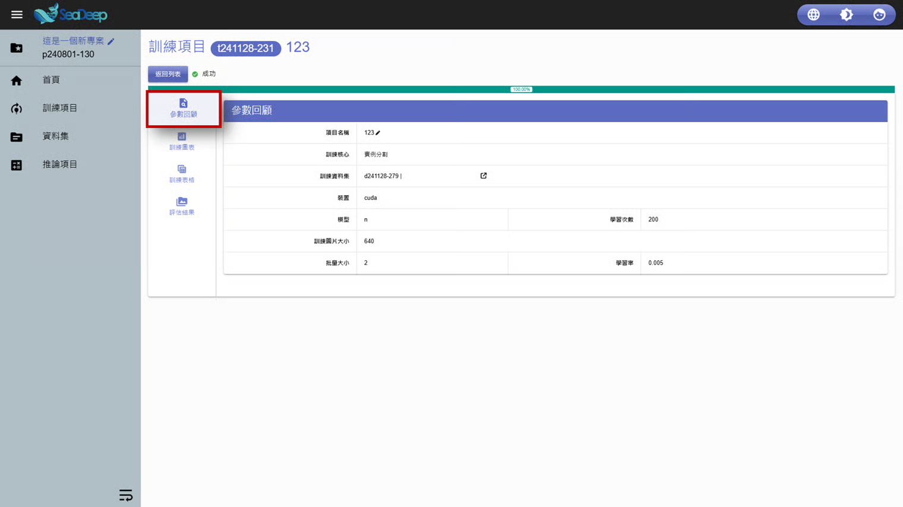
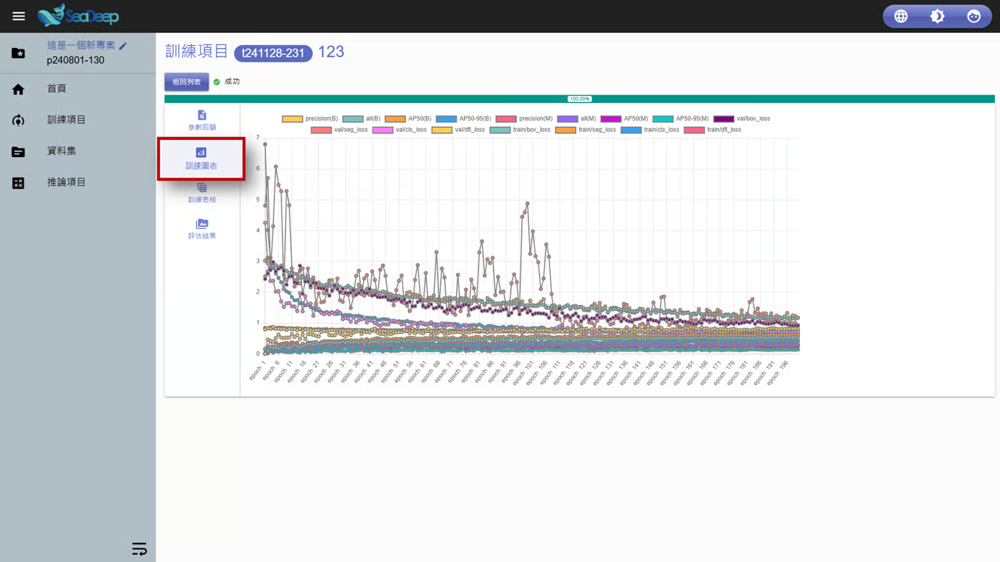
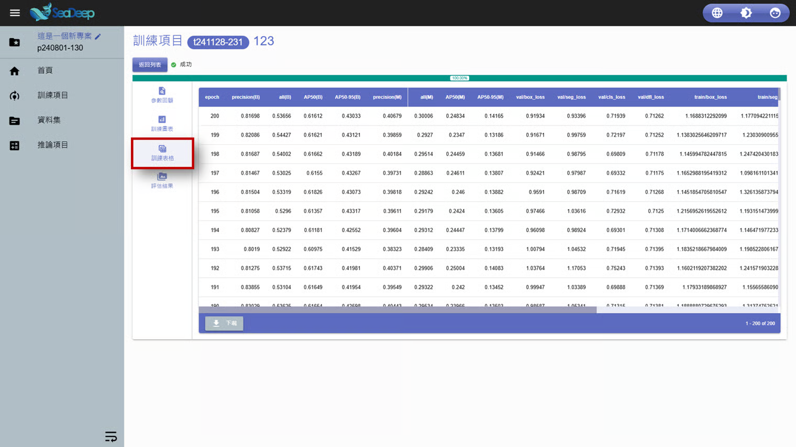
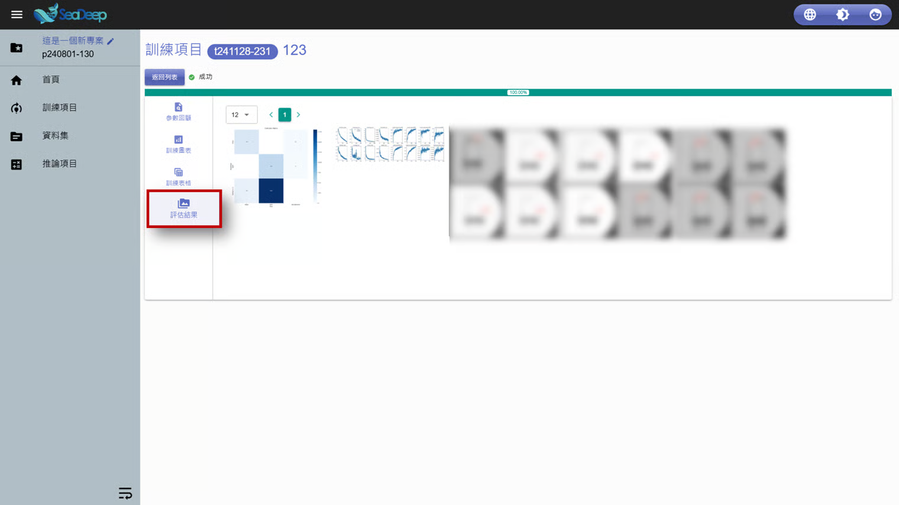

# 實例分割

## 1. 檢視訓練結果

1. 從左方工作列進入 「 <mark style="color:blue;">訓練項目</mark> 」 。
2. 點擊放大鏡圖示的 「 <mark style="color:blue;">檢視細節</mark> 」 。

## 2. 檢視訓練細節

### 2.1 參數回顧

### 2.2 訓練圖表

### 2.3 訓練表格

### 2.4 評估結果

