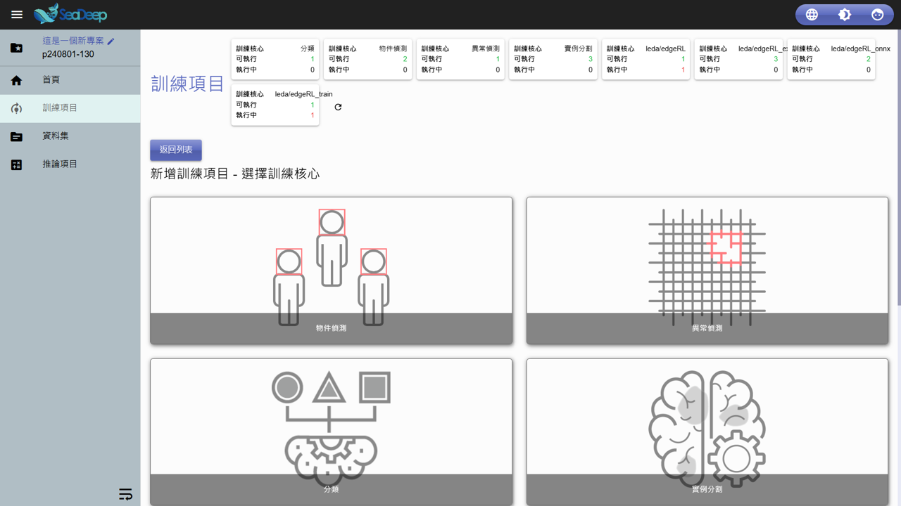

# 載入專案

## 載入近期專案

1. 將滑鼠游標移動至 「 <mark style="color:blue;">載入專案</mark> 」 上。
2. 上方將顯示近期載入過的多項專案編號與名稱。
3. 點擊欲載入的專案。


步驟 1 滑鼠游標移動至按鈕上方即可，不須點擊。


<figure><figcaption>
載入近期專案
</figcaption></figure>

***

## 載入過往專案

1. 點擊 「 <mark style="color:blue;">載入專案</mark> 」 。
2. 於右方彈出的 「 專案清單 」 中瀏覽所有專案，上方搜尋欄可輸入專案名稱快速尋找。
3. 點擊 「 <mark style="color:blue;">載入</mark> 」 進入專案首頁。

<figure><figcaption>
載入過往專案
</figcaption></figure>

<figure><figcaption>
專案首頁
</figcaption></figure>
