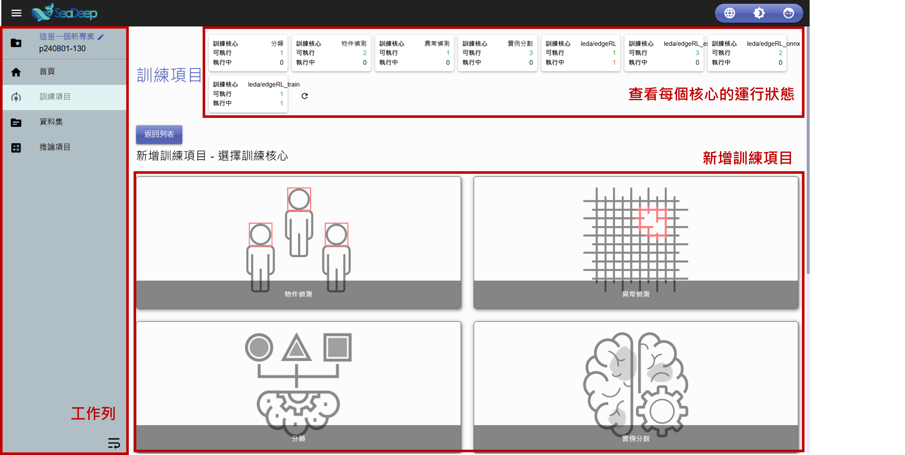

# 專案首頁

## 首頁介紹

<figure><figcaption></figcaption></figure>



### 工作列

* 專案名稱：點擊可修改專案名稱。
* 專案編號
* 首頁：點擊後將返回**入口首頁**。
* 訓練項目：查看訓練項目。
* 資料集：查看資料集。
* 推論項目：查看推論項目。

<figure><figcaption>
工作列介紹
</figcaption></figure>



### 新增訓練項目

共有 「 物件偵測 」 、 「 異常偵測 」 、 「 分類 」 、 「 實例分割 」 4種模型，點擊圖示後即可進入模型訓練設定。



### 查看每個核心的運行狀態

此區塊可查看當前每個模型的核心運行狀態：

* 可執行：此數量代表目前**可利用**的核心數量。
* 執行中：此數量代表目前**正在使用**的核心數量。



### 設定

從左至右依序為語言、網頁背景顏色以及使用者的設定

* 語言：可選擇繁體中文、簡體中文、英文。
* 背景顏色：點擊可切換深色及淺色。
* 使用者：點擊可查看使用者資訊及修改密碼。

<figure><figcaption>
設定
</figcaption></figure>


