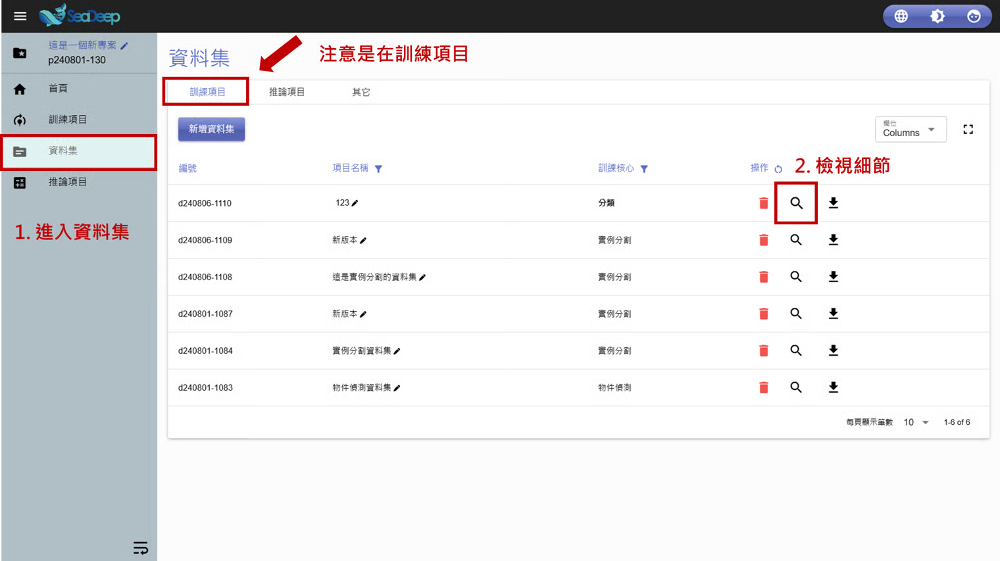
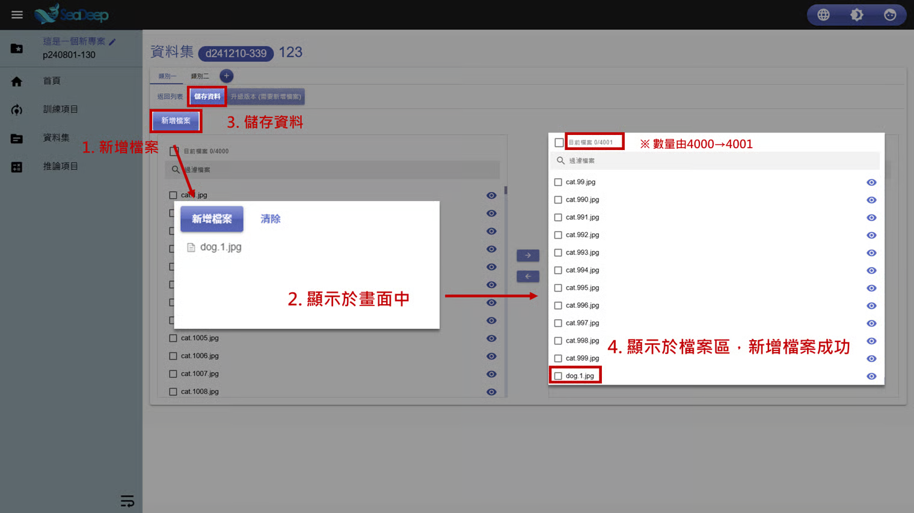

# 新增檔案

## 1. 查看資料集

1. 從左方工作列進入 「 資料集 」 。
2. 確認所在位置在**資料集內**的 「 訓練項目 」 後，點擊放大鏡圖示的 「 檢視細節 」 。

> 如需查看**推論資料集**，步驟2改為進入 「 推論項目 」 即可。

## 2. 新增檔案

1. 點擊 「 新增檔案 」 。
2. 選取要新增的圖片檔後，欲上傳的檔案會顯示在上方。
3. 點擊 「 儲存資料 」 。
4. 剛才上傳的檔案將會顯示在**檔案區**中，同時檔案數量也會更新。

