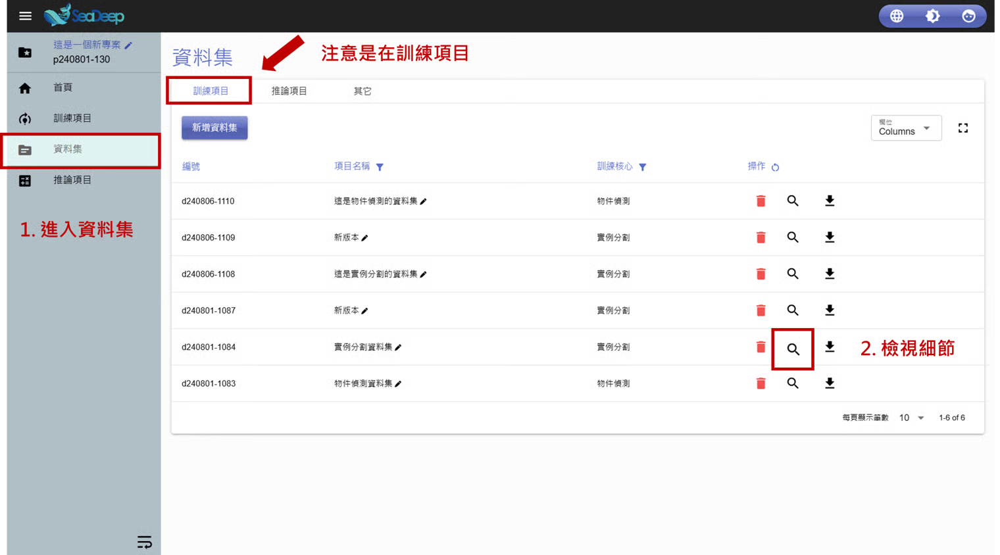
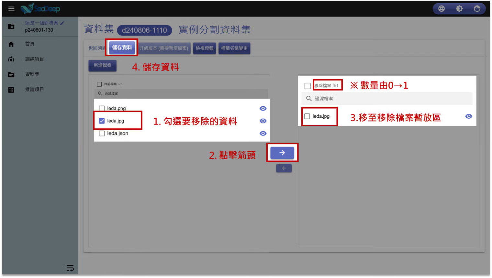

# 移除資料

## 1. 查看資料集

1. 從左方工作列進入 「 資料集 」 。
2. 確認所在位置在**資料集內**的 「 訓練項目 」 後，點擊放大鏡圖示的 「 檢視細節 」 。

> 如需查看**推論資料集**，步驟2改為進入 「 推論項目 」 即可。

## 2. 移除資料

1. 勾選要移除的檔案。
2. 點擊 「 **向右箭頭** 」 。
3. 勾選檔案自動移動至右方 「 過濾檔案 」 區塊下，上方 「 移除檔案 」 欄位數量同步更新。
4. 點擊 「 儲存資料 」 。
5. 成功移除。

