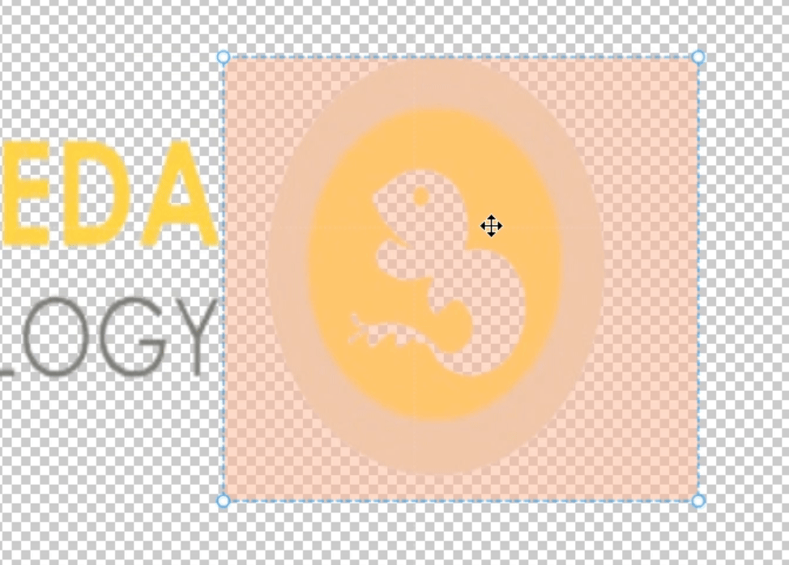
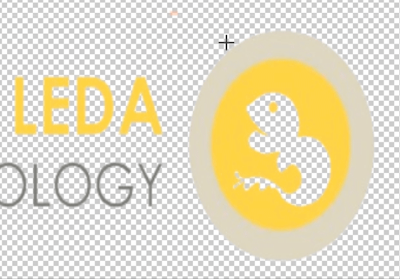
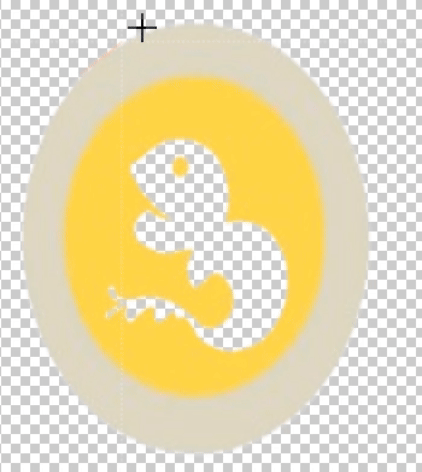

# 檢視標籤

## &#x20;1. 查看資料集

1. 從左方工作列進入 「 <mark style="color:blue;">資料集</mark> 」 。
2. 確認所在位置在**資料集內**的 「 訓練項目 」 後，點擊放大鏡圖示的 「 <mark style="color:blue;">檢視細節</mark> 」 。

<figure><figcaption>
進入資料集
</figcaption></figure>

## 2. 檢視標籤

1. 點擊 「 <mark style="color:blue;">檢視標籤</mark> 」 。
2. 檢視標籤功能頁面：**圖片區**、**功能列**、**編輯區**、**標籤區**，可於此頁面新增或修改標記。


物件偵測標記儲存格式為**VOC**（如第二張圖最上方所示）


<figure><figcaption>
檢視標籤
</figcaption></figure>

<figure><figcaption>
檢視標籤頁面介紹
</figcaption></figure>

### 2.1 功能列

#### 標記工具

<figure><figcaption>
標記工具
</figcaption></figure>

<figure><figcaption>
標記工具
</figcaption></figure>

#### 拖曳工具

<figure><figcaption>
拖曳工具
</figcaption></figure>

<figure><figcaption>
拖曳工具
</figcaption></figure>

#### 矩形工具

<figure><figcaption>
矩形工具
</figcaption></figure>

<figure><figcaption>
矩形工具
</figcaption></figure>

#### 多邊形工具


為了符合模型訓練需求，系統會在儲存標記後，自動擷取多邊形的四個最大角點，並轉換為適用於物件偵測模型（如VOC格式）的方框資料，方便後續訓練使用。


<figure><figcaption>
多邊形工具
</figcaption></figure>

<figure><figcaption>
多邊形工具
</figcaption></figure>

#### 筆刷工具


為了符合模型訓練需求，系統會在儲存標記後，自動擷取多邊形的四個最大角點，並轉換為適用於物件偵測模型（如VOC格式）的方框資料，方便後續訓練使用。


<figure><figcaption>
筆刷工具
</figcaption></figure>

<figure><figcaption>
筆刷工具
</figcaption></figure>

#### 橡皮擦工具

<figure><figcaption>
橡皮擦工具
</figcaption></figure>

<figure><figcaption>
橡皮擦工具
</figcaption></figure>

### 2.2 標籤區

* 可於 「 **標籤** 」 底下點擊 「 **-** 」 刪除標籤名稱或點擊 「 **+** 」 新增標籤名稱。
* 可於 「 **圖層** 」 底下點擊 「 **眼睛圖示** 」 隱藏標記或點擊 「 **垃圾桶圖示** 」 刪除標記。
  * &#x20;「 圖層 」 下方的資料為標記數量與每筆標記的標籤名稱。

<figure><figcaption>
標籤區
</figcaption></figure>

### 2.3 儲存

1. 在此頁面有任何變更皆須點擊 「 <mark style="color:blue;">儲存</mark> 」 。
2. 選擇 「 <mark style="color:blue;">儲存資料</mark> 」 或 「 <mark style="color:blue;">升級版本（需要新增檔案）</mark> 」 。


升級版本後續流程請[參考此頁面](sheng-ji-ban-ben.md)。


<figure><figcaption>
儲存變更
</figcaption></figure>
