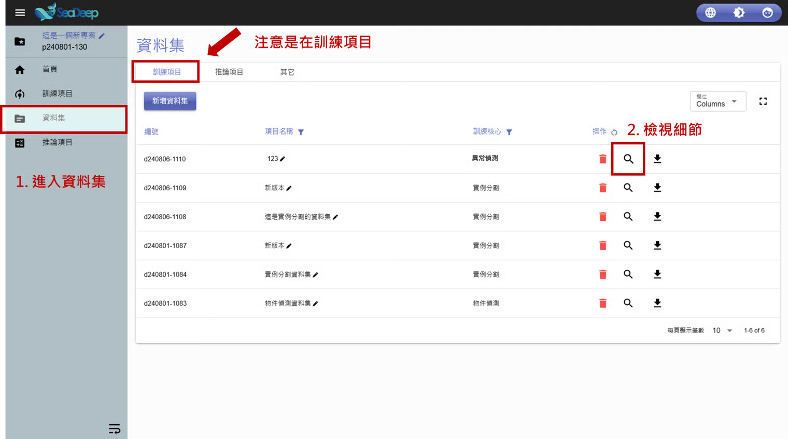
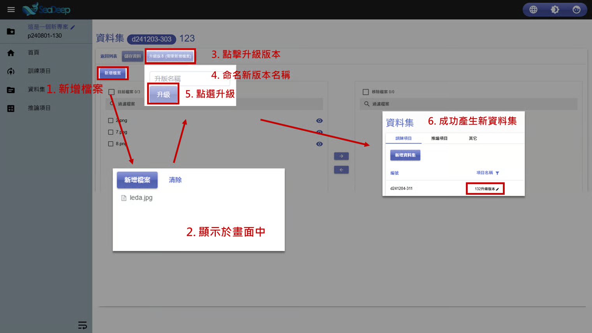

# 升級版本

## &#x20;1. 查看資料集

1. 從左方工作列進入 「 資料集 」 。
2. 確認所在位置在**資料集內**的 「 訓練項目 」 後，點擊放大鏡圖示的 「 檢視細節 」 。

> 如需查看**推論資料集**，步驟2改為進入 「 推論項目 」 即可。

## 2. 升級版本

1. 點擊  「 新增檔案 」 。
2. 選取要新增的圖片檔後，欲上傳的檔案會顯示在上方。
3. 點擊  「 升級版本（需要新增檔案） 」 按鈕。
4. 為新版本資料集命名。
5. 點擊 「 升級 」 。
6. 成功結合舊資料與新資料，產生新資料集。

